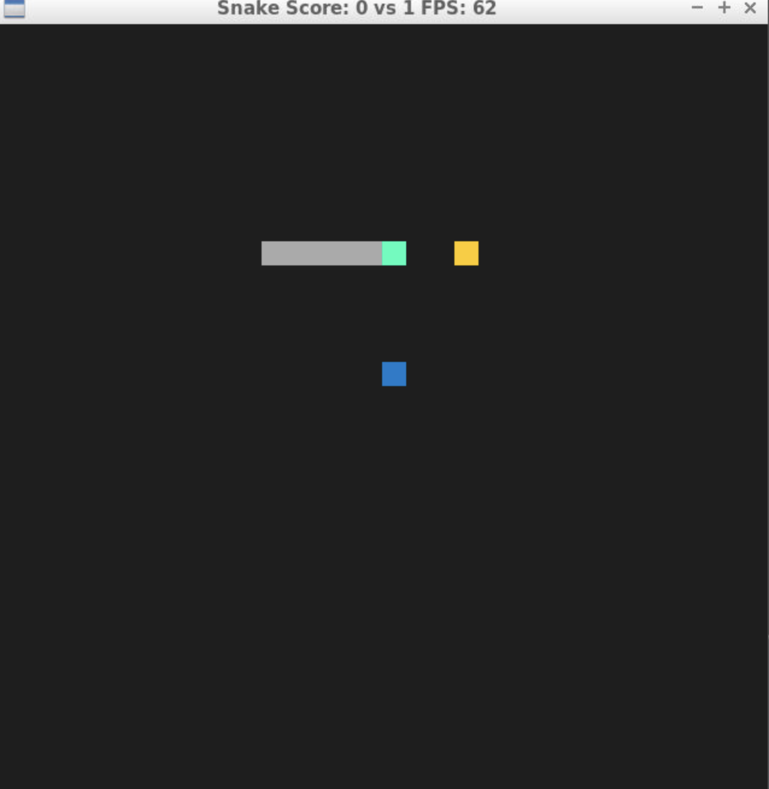
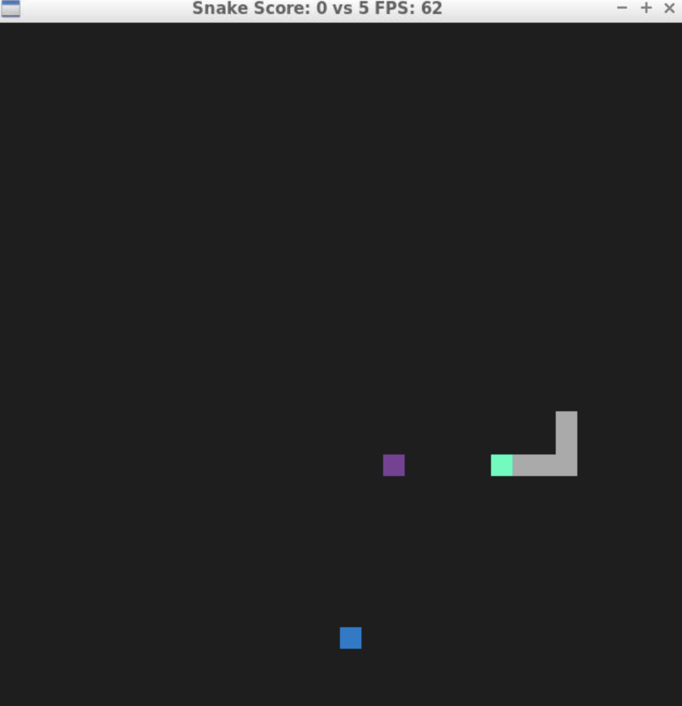
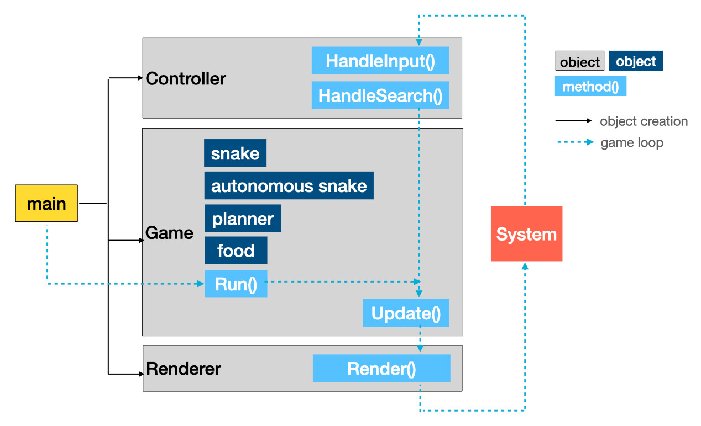

# CPPND: Capstone Snake Game

This is a slight variation of Snake Game, [https://en.wikipedia.org/wiki/Snake_(video_game_genre)](https://en.wikipedia.org/wiki/Snake_(video_game_genre)),
developed based on the starter code, [Udacity C++ Nanodegree Program](https://www.udacity.com/course/c-plus-plus-nanodegree--nd213).

## Variations

This game has three variations.
- Two snakes\
    One snake has a blue head, which is controlled by keyboard inputs. Another snake has a green head, which automatically finds a food.
- Safe and not-safe foods\
    A safe food is a yellow rectangle. When a snake captures the yellow food, its score increses. Also, the snake body grows up.
    A not-safe food is a purple rectangle. Whan a snake captures the purple food, its score decreses.
- Snake speed\
    The manually controlled snake speeds up if it gets a food. However, the automonous snake's speed never gets faster.
    This is a sort of penalty to the automonous snake since it normally out-performes.

## Dependencies for Running Locally
* cmake >= 3.7
  * All OSes: [click here for installation instructions](https://cmake.org/install/)
* make >= 4.1 (Linux, Mac), 3.81 (Windows)
  * Linux: make is installed by default on most Linux distros
  * Mac: [install Xcode command line tools to get make](https://developer.apple.com/xcode/features/)
  * Windows: [Click here for installation instructions](http://gnuwin32.sourceforge.net/packages/make.htm)
* SDL2 >= 2.0
  * All installation instructions can be found [here](https://wiki.libsdl.org/Installation)
  >Note that for Linux, an `apt` or `apt-get` installation is preferred to building from source. 
* gcc/g++ >= 5.4
  * Linux: gcc / g++ is installed by default on most Linux distros
  * Mac: same deal as make - [install Xcode command line tools](https://developer.apple.com/xcode/features/)
  * Windows: recommend using [MinGW](http://www.mingw.org/)

## Basic Build Instructions

1. Clone this repo.
2. Make a build directory in the top level directory: `mkdir build && cd build`
3. Compile: `cmake .. && make`
4. Run it: `./SnakeGame`.

## How to play

Like a normal Snake Game, use arrow keys to controll the blue snake. One of the snakes must capture the food whether the food is safe or not.
Once the food is consumed by the snake, the next food appears.

Click the __x__ on the top right corner of the Snake Game window to exit. The exit summary will show up on the terminal window where the game was started.

## Snake Game Code Structure

This Snake Game has the code structure described in the picture blow.

-  The `main` creates a `Controller`, `Game`, and `Renderer` objects. The `Game` object stores a `snake`, `automonous snake`, `planner` and `food` objects.
- The automonous snake finds a food automatically, while normal snake is controller by keyboard inputs.
- The planner object is responsible to find the shortest path to the food.
- The food object stores the position and safe or unsafe status.
- As a game loop, `main` calls `Game::Run()` to start.
- Within the game loop, `Controller::HandleInput()` (keyboard inputs) and `Controller::HandleSearch()` (shortest path finder) update the snakes' next location. Then, `Game::Update()` and `Renderer::Render()` follow to show game's next state.

## Rubric Points

1. Compiling and Testing\
    As in the Basic Build Instruction section above, the project code is able to compile and run without any errors.
2. Loops, Functions, I/O\
    Planner class has if statements and uses sort function with a customized compare function.\
    To add one more snake, some existing methods had additional arguments. For example, Renderer::Render method has additional snake argument. Also, to handle two types of foods, the same Rederer::Reder method had a food as an argument.
3. Object Oriented Programming\
    `Cell`, `Food`, and `Planner` classes were newly added to the starter code to group data/functions into individual classes. All those classes hold the own data to encapsilate the behavior.\
    Each class' data members are defined as public or private explicitly.\
    To handle two types of snakes, `Snake` class had one more overloaded contructor.
4. Memory Management\
    In `Planner::AddNeighbors()` method, cell instances are added to the neighbors used an unique pointer since the cell objects are frequently created and removed.\
    The same method receives a snake object using pass-by-reference.
5. Concurrency\
    Does not apply

## Source Code Repository

https://github.com/yokolet/sdl-snake

## CC Attribution-ShareAlike 4.0 International

Shield: [![CC BY-SA 4.0][cc-by-sa-shield]][cc-by-sa]

This work is licensed under a
[Creative Commons Attribution-ShareAlike 4.0 International License][cc-by-sa].

[![CC BY-SA 4.0][cc-by-sa-image]][cc-by-sa]

[cc-by-sa]: http://creativecommons.org/licenses/by-sa/4.0/
[cc-by-sa-image]: https://licensebuttons.net/l/by-sa/4.0/88x31.png
[cc-by-sa-shield]: https://img.shields.io/badge/License-CC%20BY--SA%204.0-lightgrey.svg
